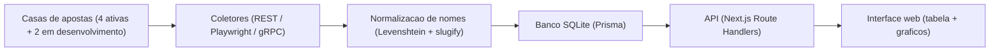

# Comparador de Odds Esportivas - Copa do Mundo 2026

Aplicacao web que coleta, normaliza e compara, em tempo quase real, odds de mercados por jogador (desarmes, faltas cometidas e faltas sofridas) de casas de apostas brasileiras. Atualmente integra 6 casas, sendo 4 em funcionamento e 2 em desenvolvimento, com destaque automatico da melhor odd, deteccao de arbitragem e historico de variacao em grafico.

> Projeto de estudo focado em **engenharia de dados**, **web scraping de fontes protegidas** e **integracao de multiplas APIs**. O objetivo foi tecnico: aprender a coletar, padronizar e cruzar dados de fontes heterogeneas e instaveis.

---

## Sobre o projeto

Cada casa de apostas publica os mesmos mercados de formas diferentes: nomes de jogadores escritos de jeitos distintos, APIs internas variadas e protecoes anti-bot. Este projeto resolve esse problema reunindo tudo em uma unica tabela comparativa, onde da pra ver lado a lado a odd de cada casa para o mesmo jogador e mercado.

## Funcionalidades

- Tabela comparativa lado a lado por jogador e por jogo
- Destaque automatico da melhor odd disponivel
- Deteccao de oportunidades de arbitragem
- Historico de variacao das odds em grafico
- Coleta automatica diaria (agendada para 08:00 BRT)
- Modo mock com dados ficticios, para rodar sem depender das casas

## Mercados suportados

Desarmes, faltas cometidas e faltas sofridas.

## Fontes de dados

| Casa | Tipo de acesso | Estrategia | Status |
| --- | --- | --- | --- |
| BetMGM | API REST direta | Endpoint publico, sem browser | Funcionando |
| Superbet | API REST direta | CDN + BetBuilder API, sem browser | Funcionando |
| Betfair | Browser (Playwright) | Intercepta requisicoes da SPA (protecao Akamai) | Funcionando |
| Pitaco | Browser + gRPC | Intercepta respostas gRPC e decodifica protobuf | Funcionando |
| Betsson | API REST + fallback | Tenta REST primeiro, usa browser se falhar | Em desenvolvimento |
| Bet365 | Browser (Playwright) | Navega a SPA e faz parsing dos dados | Em desenvolvimento |

Todas as integracoes foram descobertas via analise de trafego de rede real.

## Arquitetura



## Tecnologias

- **Frontend:** Next.js 14 (App Router), TypeScript, Tailwind CSS, Radix UI, Recharts
- **Scraping:** Playwright (Chromium headless), com sessoes persistidas, User-Agent real e delays aleatorios
- **Backend:** Next.js Route Handlers, node-cron (coleta diaria)
- **Banco de dados:** SQLite via Prisma ORM
- **Bibliotecas de apoio:** fast-levenshtein (comparacao de nomes), protobufjs (decode gRPC), winston (logging)

## Como rodar

Pre-requisitos: Node.js 18+ instalado.

```bash
# 1. Clonar o repositorio
git clone https://github.com/luanfca/Copa-Odds.git
cd Copa-Odds

# 2. Instalar as dependencias
npm install

# 3. Configurar as variaveis de ambiente
cp .env.example .env

# 4. Configurar o banco e o Playwright
npm run db:push
npx playwright install chromium

# 5. Subir o servidor de desenvolvimento
npm run dev
```

A aplicacao fica disponivel em http://localhost:3000

Comandos uteis:

```bash
npm run scrape      # roda a coleta manualmente
npm run db:studio   # abre o visualizador do banco de dados
```

Modos de execucao por variavel de ambiente:

- USE_MOCK=true roda com dados ficticios, sem acessar as casas
- SCRAPE_ON_START=true faz a coleta logo ao iniciar; caso contrario, roda todo dia as 08:00 BRT

## Desafios tecnicos

**1. Normalizacao de nomes de jogadores entre casas.**
Uma casa escreve "Vinicius Jr.", outra "Vinicius Junior", outra "V. Junior". Sem tratamento, o mesmo jogador aparecia duplicado na tabela. A solucao combina distancia de Levenshtein relativa, normalizacao de sufixos (Jr / Junior) e slugify sem acentos para reconhecer que sao a mesma pessoa.

**2. Descoberta e mapeamento das APIs internas.**
As casas sao SPAs com protecao anti-bot. Foi preciso analisar o trafego de rede real para encontrar e entender os endpoints de cada uma.

**3. Decodificacao de gRPC com protobuf (Pitaco).**
O Pitaco trafega os dados em formato binario via gRPC. Foi necessario interceptar as respostas e decodificar o protobuf manualmente para extrair as odds.

## Status e proximos passos

- Em funcionamento: Betfair, BetMGM, Superbet e Pitaco.
- Em desenvolvimento: Betsson e Bet365 (coleta das odds ainda em ajuste).

## Aprendizados

- Integracao de fontes heterogeneas e instaveis em um modelo de dados unico
- Tecnicas de web scraping resiliente em sites com protecao anti-bot
- Resolucao de entidades (entity resolution) com correspondencia aproximada de texto
- Modelagem e persistencia de dados com ORM
- Construcao de uma interface de dados de ponta a ponta

## Aviso

Projeto desenvolvido para fins de estudo e demonstracao tecnica. O uso respeita os termos de cada servico e nao incentiva apostas. Aposte com responsabilidade.

## Licenca

MIT
